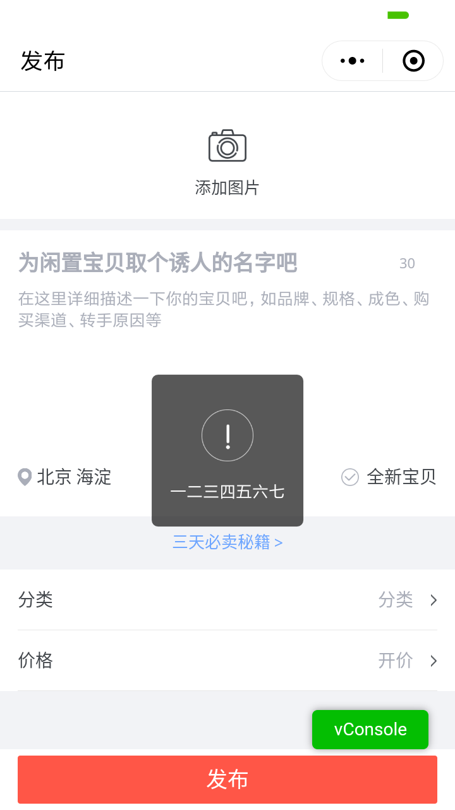
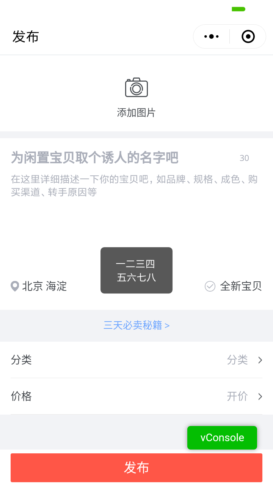
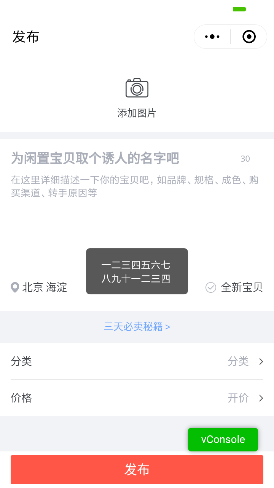
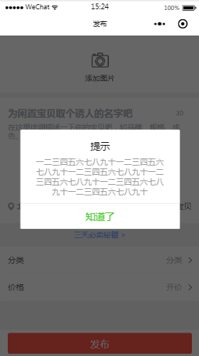

# 不受长度限制、不受层级约束的原生toast

## 背景
1. 原生toast存在长度限制，超过7个汉字会被截断；
2. 自定义toast组件 无法覆盖textarea、canvas、video、map等层级最高的原生组件；且需要每个页面反复引入，使用较为繁琐。

## 功能
1. 不受长度限制、不受层级约束的原生toast
2. 支持Promise

## 原理
1. 文案简洁时，使用带图标的原生toast
2. 文案较多时，自动改用不带图标的原生toast
3. 文案巨长时，自动改用系统弹窗  
尤其适用于后端返回的不定长报错信息/提示文案

## 效果





## 使用
app.wpy:
```js
    import {installGlobalProps} from 'fancy-mini/lib/wepyKit';
    import AdaptiveToast from 'fancy-mini/lib/AdaptiveToast';
    
    let adaptiveToast = new AdaptiveToast({
      icons: {
        success: '/images/tipsucc.png',
        fail: '/images/tipfail.png'
      }
    });
    installGlobalProps(adaptiveToast);
```

页面/组件：
```js
	 //普通使用示例
	 this.$toast({
	   title: '一二三四五六七',
	   type: 'fail',
	 });
	 
	 //promise使用示例
	 async onSubmit(){
	 	 //....
		 await this.$toast({
		   title: resp.errMsg,
		   type: 'fail',
		 });
		 console.log('toast over');
		 //....
	 }
```

项目引入及非wepy项目使用方式见 [README](../README.md)